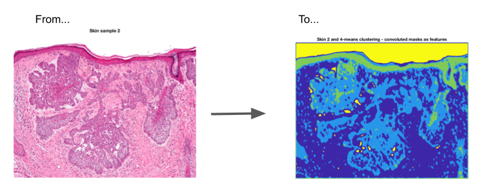

# Skin segmentation

## Goal
In this medical imaging project, I perform cancerous cells detection in histological examination of skin/epidermis.

## Results
The [`src/workbook.html`](src/workbook.html) file describes my proceedings as well as my results.
The source Matlab notebook file is also available under the [`src/workbook.mlx`](src/workbook.mlx) (Matlab Required to open it).

## Notes

This project was part of my Master Of Science curriculum at Centrale Nantes.
This project is no longer updated.
